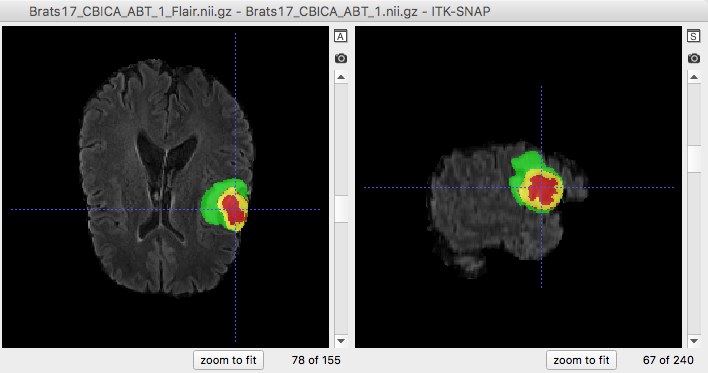

# Overview
This repository provides source code and pre-trained models for brain tumor segmentation with BraTS dataset. The method is detailed in [1], and it won the 2nd place of MICCAI 2017 BraTS Challenge. 

This implementation is based on NiftyNet and Tensorflow. While NiftyNet provides more automatic pipelines for dataloading, training, testing and evaluation, this naive implementation only makes use of NiftyNet for network definition, so that it is lightweight and extensible. A demo that makes more use of NiftyNet for brain tumor segmentation is proivde at
https://cmiclab.cs.ucl.ac.uk/CMIC/NiftyNet/tree/dev/demos/BRATS17

If you use any resources in this repository, please cite the following papers:

* [1] Guotai Wang, Wenqi Li, Sebastien Ourselin, Tom Vercauteren. "Automatic Brain Tumor Segmentation using Cascaded Anisotropic Convolutional Neural Networks." arXiv preprint arXiv:1710.04043 (2017).
https://arxiv.org/abs/1709.00382

* [2] Eli Gibson*, Wenqi Li*, Carole Sudre, Lucas Fidon, Dzhoshkun I. Shakir, Guotai Wang, Zach Eaton-Rosen, Robert Gray, Tom Doel, Yipeng Hu, Tom Whyntie, Parashkev Nachev, Marc Modat, Dean C. Barratt, Sébastien Ourselin, M. Jorge Cardoso^, Tom Vercauteren^.
"NiftyNet: a deep-learning platform for medical imaging." arXiv preprint arXiv: 1709.03485 (2017). https://arxiv.org/abs/1709.03485



An example of brain tumor segmentation result.

# Requirements
* A CUDA compatable GPU with memoery not less than 6GB is recommended for training. For testing only, a CUDA compatable GPU may not be required.

* Tensorflow. Install tensorflow following instructions from https://www.tensorflow.org/install/

* NiftyNet. Install it by following instructions from http://niftynet.io/ or simply typing:
```bash
pip install niftynet
```

* BraTS dataset. Data can be downloaded from http://braintumorsegmentation.org/

# How to use
## 1, Prepare data
* Download BraTS dataset, and uncompress the file to `./data` folder. For example, the training set will be in `./data/Brats17TrainingData` and the validation set will be in `./data/Brats17ValidationData`.

* Process the data. Run:
```bash 
python pre_process.py
```

## 2, Use pre-trained models
* Download pre-trained models from https://drive.google.com/open?id=1moxSHiX1oaUW66h-Sd1iwaTuxfI-YlBA, and save these files in `./model_pretrain`.
* Obtain binary segmentation of whole tumors, run:
```bash
python test.py config/test_wt.txt
```
* Obtain segmentation of all the tumor subregions, run:
```bash 
python test.py config/test_all_class.txt
```

## 3, How to train
The trainig process needs 9 steps, with axial view, sagittal view, coronal view for whole tumor, tumor core, and enhancing core, respectively.

The following commands are examples for these steps. However, you can edit the corresponding `*.txt` files for different configurations.

* Train models for whole tumor in axial, sagittal and coronal views respectively. Run: 

```bash
python train.py config/train_wt_ax.txt
python train.py config/train_wt_sg.txt
python train.py config/train_wt_cr.txt
```
* Train models for tumor core in axial, sagittal and coronal views respectively. Run: 

```bash
python train.py config/train_tc_ax.txt
python train.py config/train_tc_sg.txt
python train.py config/train_tc_cr.txt
```
* Train models for enhancing core in axial, sagittal and coronal views respectively. Run: 

```bash
python train.py config/train_en_ax.txt
python train.py config/train_en_sg.txt
python train.py config/train_en_cr.txt
```

## 4, How to test
Similar to 'Use pre-trained models', write a configure file that is similar to `config/test_wt.txt` or `config/test_wt.txt` and 
set the value of model_file to your own model files. Run:
```bash
python test.py your_own_config_for_test.txt
```

## 5, Evaluation
Calcuate dice scores between segmentation and the ground truth, run:
```bash
python evaluation.py
```
You may need to edit the parameters for segmentation folder and ground truth folder. 